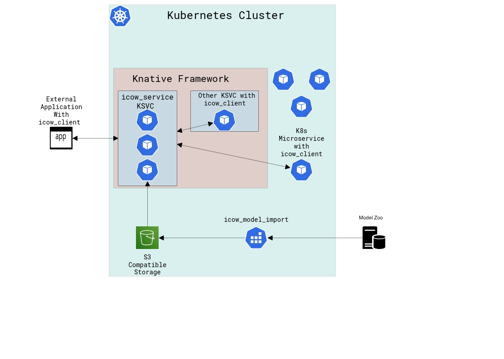

Inference with Collected ONNX Weights or Inference COW/ICOW for short, is a project to provide the inference functionality of a machine learning model without requiring the resources or dependencies to run such a model locally. The project aims to provide these capabilities while adding as few dependencies as possible to the caller of the model and requiring minimal compute resources. Additionally the project aims to remain small itself so that it primarily focuses on providing remote use of machine learning models; features that add improvements to the way models are run, like automatic batching based on available gpu memory, likely belong in an upstream projects where they may benefit all users of the upstream project including Inference COW.

## Architecture

## Why create/use inference COW
### Overcome limitations of (GPU) resources when creating/deploying microservices
When creating a microservice which relies on machine learning model(s) and deploying it through a container orchestration tool such as kubernetes there are limitations on where/how such a microservice can run. If the microservice is allowed to run on any node in the kubernetes cluster the microservice may not be run on a node with a gpu and while it will be easier to scale, it may be overall slower since allowing the microservice to deploy on any node in kubernetes prevents the microservice from using any accelerators. If the microservice is restricted to only nodes with the appropriate gpus then the microservice will have access to a gpu for acceleration however even when not in use the microservice will have full use of the gpu and no other services will be allowed to use that gpu. This makes scaling multiple microservices that require gpus within the same cluster difficult as they will compete for resources even when they are sitting idle. To overcome this issue the actual inference work that microservices need a gpu to accelerate can be extracted and performed in a single microservice which is shared among the cluster. With the inference work extracted to Inference COW the microservices that rely on machine learning models will be able to freely scale on any node without worrying about access to a gpu and when those microservices are sitting idle the Inference COW microservice will still be available to any other microservice that still needs it.

### Provide a language independent way of accessing machine learning inference capabilities
To access our machine learning inference capabilities currently we exclusively use python. Should the need arise to utilize these models within other systems that do not support python or would prefer not to use it, a language independent interface would be necessary. While Inference COW implements its server in python and provides a reference client implementation in python, it defines its services and requests with an Interface Definition Language protobuf and communicates to clients through the common protocol gRPC for remote procedure calls. If another client implementation becomes required the protobuf file which describes the communication can be used to generate a client in any language supported by the Protocol Compiler protoc.

### Provide the ability to remotely access and use inference models as services with acceleration
To make use of our machine learning models currently would require the direct import and use of machine learning libraries. While our current development does not prohibit this it requires using a particular version of python and installing machine learning libraries locally. This also means projects that would like to utilize our inference capabilities must depend on these machine learning libraries. Additionally if the project calls for accelerated inference then the local machine would need to have a gpu available for acceleration. Inference COW provides the use of inference models remotely potentially with gpu acceleration while only requiring that a client follow the protocol.
